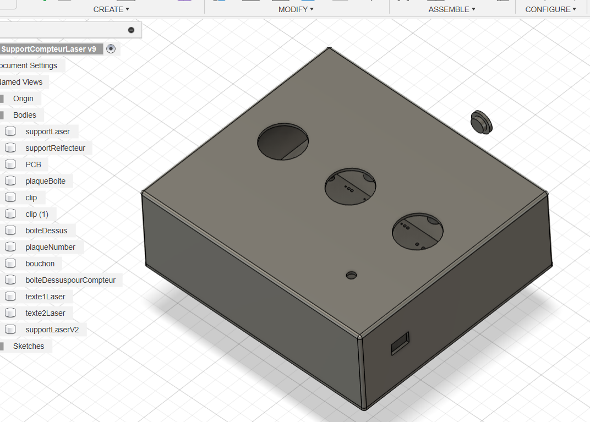

# 🧑‍🔬 PeopleLaserCounter

## License

<a rel="license" href="http://creativecommons.org/licenses/by-nc-sa/4.0/"></a><br />This work is licensed under a <a rel="license" href="http://creativecommons.org/licenses/by-nc-sa/4.0/">Creative Commons Attribution-NonCommercial-ShareAlike 4.0 International License</a>.


## 🎯 Objectif du projet

Système de comptage de personnes utilisant des **capteurs analogiques** (comme des lasers ou photodiodes) et une **carte Arduino**. Il permet de **détecter** et **compter** les passages à l’entrée et à la sortie d’un lieu.

Le compteur peut être :
- Automatiquement mis à jour via des **capteurs analogiques (lasers)**.
- Manuellement contrôlé à l’aide de **boutons physiques**.

L’objectif principal est de **transmettre régulièrement la valeur du compteur par communication RF (Radio Fréquence)** à un système distant.

---

## 🏗️ Architecture du projet

### 📁 Structure des fichiers

```bash
PeopleLaserCounter/
├── include/              # Fichiers d'en-tête génériques (README uniquement ici)
├── lib/                  # Bibliothèques additionnelles (non utilisées dans ce projet)
├── src/                  # Code source principal
│   ├── main.cpp          # Logique principale : détection + envoi RF
│   ├── counter.cpp       # Logique de comptage
│   ├── AnalogButton.cpp  # Détection analogique de type "laser"
│   └── *.h               # Fichiers d'en-tête
├── test/                 # Tests (README uniquement ici)
├── platformio.ini        # Configuration PlatformIO
└── .vscode/              # Config de l’environnement de dev (optionnel)
```

## ⚙️ Fonctionnalités module principal

### 🔌 Capteurs analogiques (Laser/Photodiode)
- 2 capteurs connectés aux broches **A0** et **A1**
- Détection de passage par dépassement d’un seuil : `LASER_THRESHOLD`

### 🔘 Boutons physiques
- **Incrémentation** : broche **2**
- **Décrémentation** : broche **3**
- **Reset long** (appui ≥ 3 secondes) : broche **4**

### 📡 Communication RF
- Utilisation de la bibliothèque **RCSwitch**
- Envoi des données toutes les **15 secondes** (ou à l'utilisation d'un bouton)
  - Modifiable via la constante `GLOBAL_REFRESH_RATE`
- Transmission via la broche **8**

### 🔧 Dépendances
- [`ezButton`](https://github.com/ArduinoGetStarted/ezButton)
- [`RCSwitch`](https://github.com/sui77/rc-switch)
- [`arduino-timer`](https://github.com/contrem/arduino-timer)

## ⚙️ Fonctionnalités module secondaire (compteur)

### 🔌 Afficheur LEDS
- Bandeau de LEDs à la broche **8**

### 📡 Communication RF
- Utilisation de la bibliothèque **RCSwitch**
- Réception via la broche **2**

### 🔧 Dépendances
- [`FastLED`](https://github.com/FastLED/FastLED)
- [`RCSwitch`](https://github.com/sui77/rc-switch)


---

## 📟 PCB

Initialement, le projet devrait être mis sur un seul PCB. Mais ce dernier peut être commun aux 2 modules en sélectionnant uniquement les connexions nécessaires.

[Fichier Gerber](PCB/PeopleLaserCounter-main.zip) qui peut être construit par un service en ligne.

Liste du matériel utilisé : 

- 2 alimentations 220V vers 12V (1A suffit pour le modules avec les lasers, il faut compteur plus pour le module LEDs mais cela dépend aussi du nombre de LEDs par segment)
- 2 Arduino UNO
- 2 modules HCW-P715 (12V vers 5V)
- Des LEDs adressables compatibles Arduino
- Un émetteur et récepteur radio fréquence 433Mhz compatible Arduino
- Des boutons, du fil, des cosses et des connecteurs divers (type jst xh en 2.54mm)


--- 

## 🧩 Les fichiers 3D STL

Vous pouvez trouver des boitiers pour impressions 3D dans le dossier [STL](/STL/)

Des inserts filetés pour vis M5 sont utilisés afin de fermer le boitier.

Les fichiers concernant l'affichage des nombres provient de ce projet : https://github.com/leonvandenbeukel/7-Segment-Digital-Clock-V2





